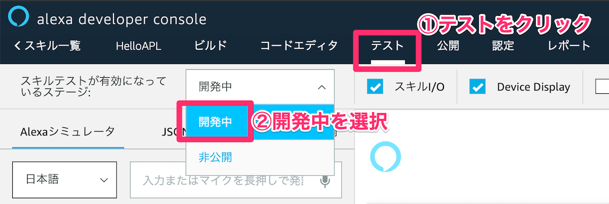
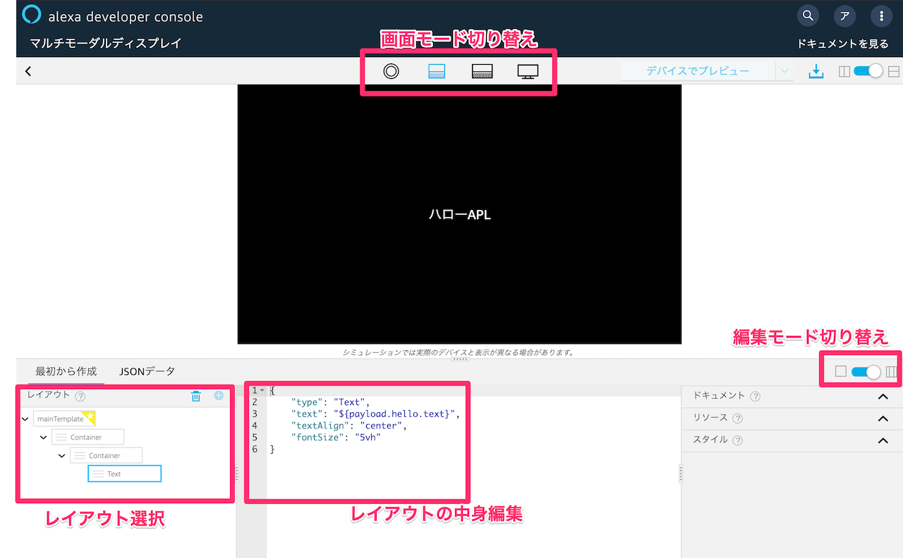
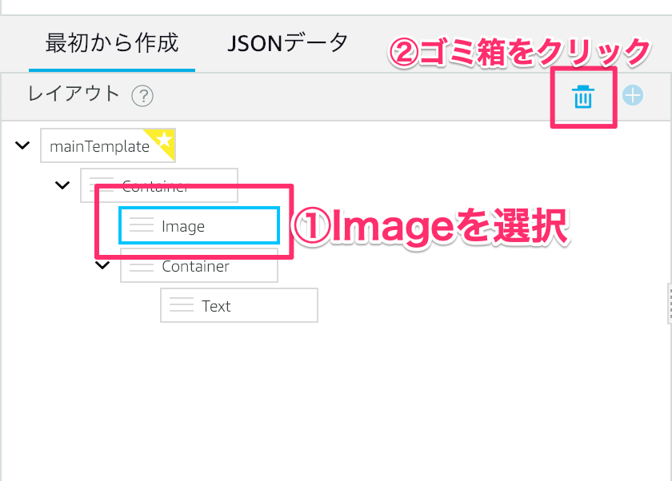
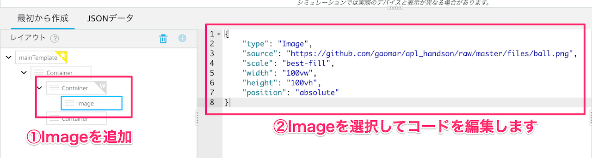
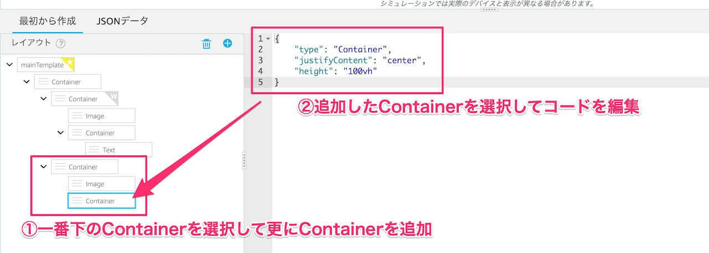
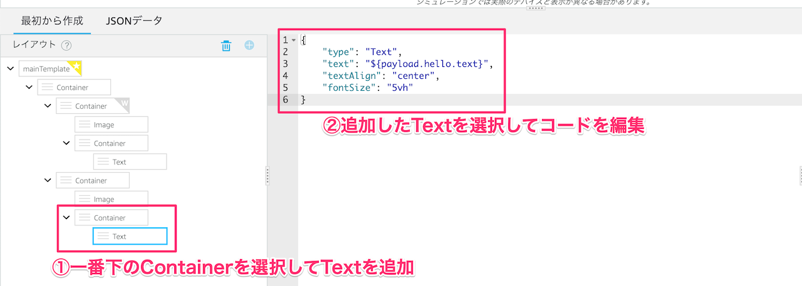
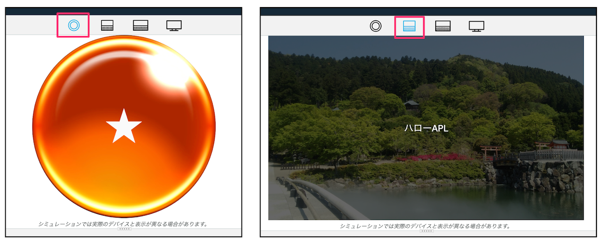
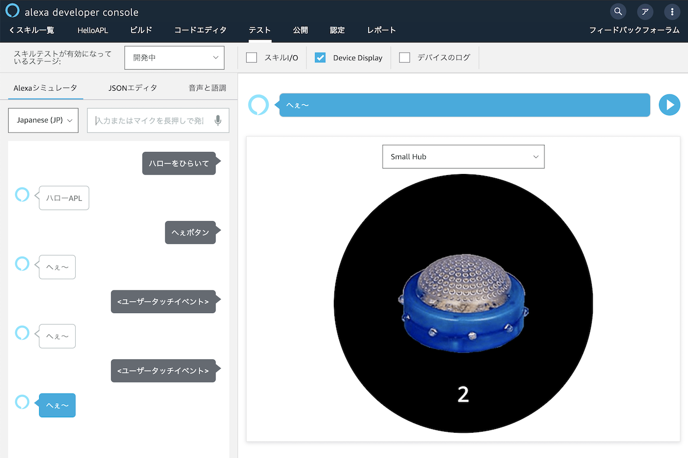
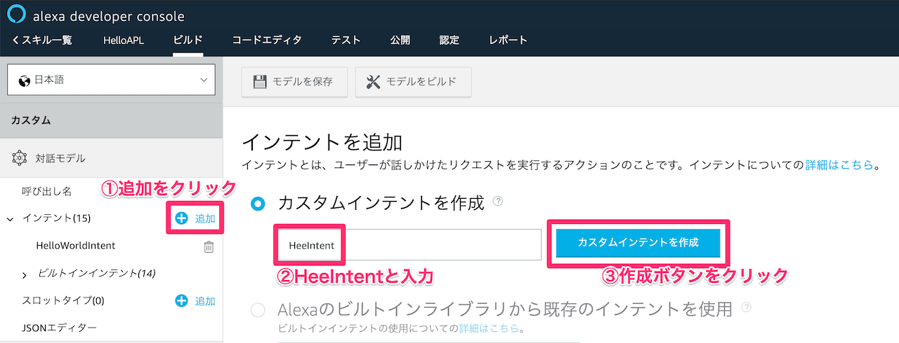

# APLハンズオン
## プロジェクトを作成する
新規スキルのプロジェクトを作成します。こちらにアクセスしてください。

[https://developer.amazon.com/ja/alexa-skills-kit](https://developer.amazon.com/ja/alexa-skills-kit
)

### 1-1. スキル開発を始めよう！
［スキル開発を始める］をクリックします。


Amazonのアカウント情報を入力してログインします。


［スキルの作成］ボタンをクリックします。


スキル名を入力して、［カスタム］と［Alexaがホスト］をそれぞれ選択します。  
最後に［スキルを作成］ボタンをクリックします。


左側のメニューにある［呼び出し名］をクリックします。スキル名を「ハロー」に変更します。  
必ず変更したら必ず［モデルを保存］と［モデルをビルド］をクリックします。

※保存してビルドをしないと反映されないので注意しましょう！


### 1-2. シミュレーターで動かそう
Alexaは実機が無くても動作を確認することができます。  
テストタブをクリックして、プルダウンメニューから［開発中］を選択します。



これでシミュレーターの準備ができました。「ハローをひらいて」と入力して、スキルが動作することを確認します。  
今は英語の文章が返ってくれば問題ありません。


## Alexa Presentation Languageに触れてみよう！
いよいよAlexa Presentation Language（以降 APL）に触れていきたいと思います。  
APLは2018年10月30日にパブリックベータ版として公開されました。

[https://developer.amazon.com/ja/blogs/alexa/post/be1b08ef-fa61-4884-9e30-1d6ff6882dba/jp-alexa-presentation-language-publicbeta](https://developer.amazon.com/ja/blogs/alexa/post/be1b08ef-fa61-4884-9e30-1d6ff6882dba/jp-alexa-presentation-language-publicbeta
)

簡単にAPLを解説するとEcho ShowやEcho Spotなどの画面付きスマートスピーカーに対してよりリッチな表現を実現するための新デザイン言語です。

### 2-1. APLを有効化
APLは初期状態では無効設定になっていますので、必ず使用する際は設定を有効にする必要があります。  

ビルドタブを押して元の画面に戻ります。  

左側のメニューの［インターフェース］をクリックして、  
「Displayインターフェース」と「Alexa Presentation Language」のチェックを有効にします。  
必ずこの2つを有効にしてください。


### 2-2. APLに触れる
左側のメニューにある［画面表示］をクリックします。すると別の画面の画面が表示されます。
直接リンクから飛ぶこともできます。

[https://developer.amazon.com/alexa/console/ask/displays](https://developer.amazon.com/alexa/console/ask/displays)


画面が表示されたら、［コードをアップロード］を選びます。  
アップロードするコードはこちらからダウンロードしてください。

[https://raw.githubusercontent.com/gaomar/apl_handson/master/files/apl_hello.json](https://raw.githubusercontent.com/gaomar/apl_handson/master/files/apl_hello.json)


アップロードすると編集画面が表示されます。



### 2-3. 文字を変えてみよう
「ハローAPL」と書かれている文字を違う文字に変えてみましょう。  
編集方法は「JSONデータ」タブをクリックします。すると表示されている内容が変わります。「ハローAPL」と書かれている部分を好きな文字に変えてみましょう。

するとリアルタイムで文字列が変更されます。


### 2-4. 背景画像を入れてみよう
背景が黒一色だと寂しいですね。レイアウト画面から`Image`を追加して、背景を実装してみましょう。

レイアウト選択で一番最初にあるContainerをクリックして、［＋］ボタンをクリックします。


ポップアップが表示されるので、プルダウンメニューから`Image`を選択し、［typeを追加］ボタンをクリックします。


`Image`をクリックして、コードを編集します。


コードはこちらをコピペしてください。

```javascript
{
    "type": "Image",
    "source": "https://github.com/gaomar/apl_handson/raw/master/files/background.jpg",
    "scale": "best-fill",
    "width": "100vw",
    "height": "100vh",
    "position": "absolute"
}
```

このままだと最初に表示した文字列が背景より後ろになってしまうので、表示順番を入れ替えます。  
三部分をドラッグしてImageを上にもっていきます。


これで文字が見えるようになりました。


### 2-5. 背景色にオーバーレイカラーを載せる
このままだと文字が見えにくいので背景色にオーバーレイカラーを載せて、文字を見やすくしてみましょう。

コードを書きのように修正してみましょう。`overlayColor`というプロパティを追加します。

```javascript
{
    "type": "Image",
    "source": "https://github.com/gaomar/apl_handson/raw/master/files/background.jpg",
    "scale": "best-fill",
    "width": "100vw",
    "height": "100vh",
    "position": "absolute",
    "overlayColor": "rgba(0, 0, 0, 0.6)"
}
```

これで文字が見やすくなりました。わざわざオーバーレイカラーの画像を作成しなくてもこのプロパティを追記するだけで簡単に作れます。


### 2-6. デバイスの判定プロファイルを適用する
Echo Spotはこのレイアウト、Echo Showではこのレイアウトという風に、デバイスに応じてレイアウトを変更することがあるかと思います。

デバイスの判定は`alexa-viewport-profiles`というものをインポートすると判定することができます。


コード

```javascript
{
    "type": "APL",
    "version": "1.0",
    "theme": "dark",
    "import": [
        {
            "name": "alexa-viewport-profiles",
            "version": "1.0.0"
        }
    ]
}
```

### 2-7. 小型デバイスレイアウトを追加する
小型デバイスのEcho Spot用のレイアウトを作ってみましょう。丸い形を活かしたデザインにします。  
まず既にあるContainerを削除します。



出てきたポップアップで`Proceed`をクリックします。


2つ目のContainerが消えました。新たにContainerを追加します。


出てきたポップアップで`Container`を選択して、［追加］ボタンをクリックします。


もう１つ`Container`を追加します。


このように2つできればOKです。


### 2-8. 小型デバイスレイアウトを適用する
1つ目の`Container`を選択して、コードを編集します。


```javascript
{
    "when": "${@viewportProfile == @hubRoundSmall}",
    "type": "Container"
}
```

レイアウト判定は`when`プロパティを使います。whenはif文みたいなものです。  
判定のプロパティ値は下記の通りです。

| リソース   | 値    |
|:-------------|:------------------|
| hubRoundSmall |    小型デバイス（Echo Spot）        |
| hubLandscapeMedium |    中型デバイス（Echo Show 第１世代）        |
| hubLandscapeLarge |    大型デバイス（Echo Show 第２世代）        |
| tvLandscapeXLarge |    超大型TV（Fire TVなど）        |

2つ目の`Container`をクリックして`Image`を追加します。



コードを編集します。

```javascript
{
    "type": "Image",
    "source": "https://github.com/gaomar/apl_handson/raw/master/files/ball.png",
    "scale": "best-fill",
    "width": "100vw",
    "height": "100vh",
    "position": "absolute"
}
```

2つ目の`Container`をクリックして更に`Container`を追加します。


```javascript
{
    "type": "Container",
    "justifyContent": "center",
    "height": "100vh"
}
```

追加した`Container`で更に`Text`を追加します。



```javascript
{
    "type": "Text",
    "text": "★",
    "textAlign": "center",
    "fontSize": "20vh"
}
```

### 2-9. それ以外のレイアウトを適用する
追加した2つ目の`Container`をクリックして、`Image`を追加します。


```javascript
{
    "type": "Image",
    "source": "https://github.com/gaomar/apl_handson/raw/master/files/background.jpg",
    "scale": "best-fill",
    "width": "100vw",
    "height": "100vh",
    "position": "absolute",
    "overlayColor": "rgba(0, 0, 0, 0.6)"
}
```

`Container`を追加します。



```javascript
{
    "type": "Container",
    "justifyContent": "center",
    "height": "100vh"
}
```



```javascript
{
    "type": "Text",
    "text": "${payload.hello.text}",
    "textAlign": "center",
    "fontSize": "5vh"
}
```

最終的にこのようなレイアウトになれば完成です。


うまくいかない方はこちらからダウンロードしてファイルをインポートしてください。

[https://raw.githubusercontent.com/gaomar/apl_handson/master/files/apl_layout.json](https://raw.githubusercontent.com/gaomar/apl_handson/master/files/apl_layout.json)

### 2-10. レイアウトを確認する
小型デバイスや中型デバイスに切り替えると適用したレイアウトに切り替わると思います。



## APLをスキルから適用する
これまで作ってきたAPLをスキルから呼び出してみましょう。  
まずはコードを一旦書き出してみます。


`apl_template_export.json`ファイルがダウンロードされますので開いてください。  
document部分のみを選択してください。

```javascript
{
    "document": {
        ...
    },
    "dataSources": {
        ...
    }
}
```

### 3-1. documentを新規作成する
document部分のみをコピーしてデベロッパーコンソールの［コードエディタ］タブをクリックしてから左上の新規ドキュメントアイコンをクリックして作成します。


ファイル名を`apl_document.json`として［Create File］ボタンをクリックします。


先程コピーしたコードを貼り付けます。貼り付けたら［Save］ボタン押します。


コードはこちら。
[https://raw.githubusercontent.com/gaomar/apl_handson/master/files/apl_document.json](https://raw.githubusercontent.com/gaomar/apl_handson/master/files/apl_document.json)


```javascript
{
    "type": "APL",
    "version": "1.0",
    "theme": "dark",
    "import": [
        {
            "name": "alexa-viewport-profiles",
            "version": "1.0.0"
        }
    ],
    "resources": [
        {
            "strings": {
                "skillName": "HelloAPL"
            }
        }
    ],
    "styles": {},
    "layouts": {},
    "mainTemplate": {
        "parameters": [
            "payload"
        ],
        "items": [
            {
                "type": "Container",
                "items": [
                    {
                        "when": "${@viewportProfile == @hubRoundSmall}",
                        "type": "Container",
                        "items": [
                            {
                                "type": "Image",
                                "source": "https://github.com/gaomar/apl_handson/raw/master/files/ball.png",
                                "scale": "best-fill",
                                "width": "100vw",
                                "height": "100vh",
                                "position": "absolute"
                            },
                            {
                                "type": "Container",
                                "justifyContent": "center",
                                "height": "100vh",
                                "item": [
                                    {
                                        "type": "Text",
                                        "text": "★",
                                        "textAlign": "center",
                                        "fontSize": "20vh"
                                    }
                                ]
                            }
                        ]
                    },
                    {
                        "type": "Container",
                        "items": [
                            {
                                "type": "Image",
                                "source": "https://github.com/gaomar/apl_handson/raw/master/files/background.jpg",
                                "scale": "best-fill",
                                "width": "100vw",
                                "height": "100vh",
                                "position": "absolute",
                                "overlayColor": "rgba(0, 0, 0, 0.6)"
                            },
                            {
                                "type": "Container",
                                "justifyContent": "center",
                                "height": "100vh",
                                "item": [
                                    {
                                        "type": "Text",
                                        "text": "${payload.hello.text}",
                                        "textAlign": "center",
                                        "fontSize": "5vh"
                                    }
                                ]
                            }
                        ]
                    }
                ]
            }
        ]
    }
}
```

### 3-2. スキルプログラムを編集する
既にあるindex.jsファイルを開きます。6行目にある`LaunchRequestHandler`の関数を編集します。
addDirectiveという部分でAPLのdocumentを指定します。  
datasourcesに中型デバイスで表示する文字列を指定します。

```javascript:index.js
const LaunchRequestHandler = {
    canHandle(handlerInput) {
        return handlerInput.requestEnvelope.request.type === 'LaunchRequest';
    },
    handle(handlerInput) {
        const speechText = 'ハローAPL';
        // documentとdataをそれぞれ指定する
        return handlerInput.responseBuilder
            .speak(speechText)
            .addDirective({
                type : 'Alexa.Presentation.APL.RenderDocument',
                version: '1.0',
                token: "token",
                document: require('./apl_document.json'),
                datasources: {
                    "hello": {
                        "text": "ハローAPL"
                    }
                }
            })            
            .getResponse();
    }
};
```

［テスト］タブをクリックしてシミュレーター画面を表示してください。シミュレーターで実行するとAPLが適用されたレイアウトを確認することができます。


実機で確認もしてみてください。
Echo Spotだとますますドラゴ◯ボールっぽく見えますね


### 3-3. Alexa-hostedのS3から画像を呼ぶ
Alexa-hostedにはS3も使えます。
コードエディタの左下にS3のリンクがあるのでクリックします。


S3のページが表示されたら、画像をアップロードするので［アップロード］ボタンを押します。


お好きな画像でも良いですし、こちらのball.pngファイルでも構いません。
好きなファイルをアップロードしましょう。


apl_document.jsonを開いて、34行目のsourceの値を変更します。
`${payload.hello.ballImage}`に変えてください。


index.jsも編集します。S3に保存している画像ファイルのURLを取得しましょう。


下記のように編集します。

```javascript:index.js
const Alexa = require('ask-sdk-core');
const Util = require('util.js');

const LaunchRequestHandler = {
    canHandle(handlerInput) {
        return handlerInput.requestEnvelope.request.type === 'LaunchRequest';
    },
    handle(handlerInput) {
        const speechText = 'ハローAPL';
        const pictureUrl = Util.getS3PreSignedUrl("Media/ball.png");

        // documentとdataをそれぞれ指定する
        return handlerInput.responseBuilder
            .speak(speechText)
            .addDirective({
                type : 'Alexa.Presentation.APL.RenderDocument',
                version: '1.0',
                token: "token",
                document: require('./apl_document.json'),
                datasources: {
                    "hello": {
                        "text": "ハローAPL",
                        "ballImage": pictureUrl
                    }
                }
            })            
            .getResponse();
    }
};
```

これでAlexa-hostedのS3側にあるファイルから呼び出すことができました。

## タッチ処理を実装しよう
画面タッチ処理を実装します。タッチしたらイベントを検知して数をカウントする  
昔流行った「へぇボタン」を作ります。



### 4-1. インテントを追加する
へぇボタンの画面を表示させるために、インテントを新規作成します。  
［ビルド］タブをクリックして、インテントの［追加］ボタンをクリックして、インテント名を`HeeIntent`と入力します。［カスタムインテントを作成］ボタンをクリックして作成します。



このインテントが反応するための言葉を登録します。サンプル発話に「へぇボタン」と入力して、`Enter`キーを押してください。

最後に必ずインテントの［モデルを保存］ボタンと［モデルをビルド］ボタンをそれぞれクリックします。


### 4-2. APLを実装する
APLのレイアウトを組み込みます。［コードエディタ］タブをクリックしてから、左上の新規ドキュメントアイコンをクリックして作成してください。  
ファイル名は「apl_hee.json」としました。


コードは下記の通りです。

```javascript:apl_hee.json
{
    "type": "APL",
    "version": "1.0",
    "theme": "dark",
    "import": [],
    "resources": [],
    "styles": {},
    "layouts": {
        "heeLayout": {
            "parameters": [
                {
                    "name": "imageUrl",
                    "type": "string"
                }
            ],
            "items": [
                {
                    "type": "Container",
                    "alignItems": "center",
                    "justifyContent": "center",
                    "height": "100vh",
                    "items": [
                        {
                            "type": "Image",
                            "scale": "best-fit",
                            "height": "50vh",
                            "width": "50vw",
                            "align": "center",
                            "source": "${imageUrl}"
                        }
                    ]
                }
            ]
        }
    },
    "mainTemplate": {
        "parameters": ["payload"],
        "items": [
            {
                "type": "Container",
                "items": [
                    {
                        "type": "Pager",
                        "width": "100vw",
                        "height": "100vh",
                        "id": "myPager",
                        "initialPage": 0,
                        "items": [
                            {
                                "type": "TouchWrapper",
                                "onPress": {
                                    "type": "SendEvent",
                                    "arguments": [
                                        "touch"
                                    ]
                                },
                                "item": {
                                    "type": "heeLayout",
                                    "imageUrl": "${payload.hello.hee_off}"
                                }
                            },
                            {
                                "type": "heeLayout",
                                "imageUrl": "${payload.hello.hee_on}"
                            }
                        ]
                    },
                    {
                        "type": "Container",
                        "height": "100vh",
                        "position":"absolute",
                        "alignItems": "center",
                        "justifyContent": "end",
                        "paddingBottom": "10vh",
                        "items": {
                            "type": "Text",
                            "width": "100vw",
                            "textAlign": "center",
                            "text": "${payload.hello.myCount}"
                        }                        
                    }
                ]
            }
        ]
    }
}
```

[APLオーサリングツール](https://developer.amazon.com/alexa/console/ask/displays)でこのコードを貼り付けると以下のようになります。  
`heeLayout`とありますが、自分でオリジナルのレイアウトを適用することができます。

 ※実際にAPLオーサリングツールで試す場合はこちらのjsonファイルで試してください
[https://raw.githubusercontent.com/gaomar/apl_handson/master/files/apl_hee.json](https://raw.githubusercontent.com/gaomar/apl_handson/master/files/apl_hee.json)

 


typeの`Pager`で画面をスワイプするとへぇボタンのOFFとON画像が切り替わります。またOFF状態のへぇボタンをタッチできるように`TouchWrapper`を使います。

### 4-3. プログラムを修正する
APLを適用するためにindex.jsファイルを編集します。コードエディタからindex.jsを開いてください。

コード量が多いので抜粋しています。全コードはこちらからダウンロードしてください。

[https://raw.githubusercontent.com/gaomar/apl_handson/master/files/index.js](https://raw.githubusercontent.com/gaomar/apl_handson/master/files/index.js)


※自分で編集される際は`addRequestHandlers`に関数を追加するのを忘れないようにしてください。

```javascript:index.js
const HeeIntentHandler = {
    canHandle(handlerInput) {
        return handlerInput.requestEnvelope.request.type === 'IntentRequest'
            && handlerInput.requestEnvelope.request.intent.name === 'HeeIntent';
    },
    handle(handlerInput) {
        const speechText = 'へぇ〜';
        return handlerInput.responseBuilder
            .speak(speechText)
            .addDirective({
                type : 'Alexa.Presentation.APL.RenderDocument',
                version: '1.0',
                token: "token",
                document: require('./apl_hee.json'),
                datasources: {
                    "hello": {
                        "hee_off": "https://github.com/gaomar/apl_handson/raw/master/files/hee_off.png",
                        "hee_on": "https://github.com/gaomar/apl_handson/raw/master/files/hee_on.png",
                        "myCount": 0
                    }
                }
            })            
            .getResponse();
    }
};
const TouchEventHandler = {
    canHandle(handlerInput) {
    return ((handlerInput.requestEnvelope.request.type === 'Alexa.Presentation.APL.UserEvent' &&
        (handlerInput.requestEnvelope.request.source.handler === 'Press' || 
        handlerInput.requestEnvelope.request.source.handler === 'onPress')));
    },
    handle(handlerInput) {
        // セッション情報の取得
        var myCount = 0;
        const attributes = handlerInput.attributesManager.getSessionAttributes();
        // 初期化
        if(!attributes.counter){ 
            myCount = 1;
        } else {
            myCount = attributes.counter;
            myCount++;
        }
        attributes.counter = myCount;
        handlerInput.attributesManager.setSessionAttributes(attributes);

        const speechText = 'へぇ〜';
        return handlerInput.responseBuilder
            .speak(speechText)
            .addDirective({
                type : 'Alexa.Presentation.APL.ExecuteCommands',
                token: "token",
                commands: [
                    {
                        type: "Sequential",
                        commands: [
                            {
                                "type": "SetPage",
                                "componentId": "myPager",
                                "position": "absolute",
                                "value": 1
                            },
                            {
                                type: "Idle",
                                delay: 500
                            },
                            {
                                "type": "SetPage",
                                "componentId": "myPager",
                                "position": "absolute",
                                "value": 0
                            }
                        ]
                    }
                ]
            }) 
            .addDirective({
                type : 'Alexa.Presentation.APL.RenderDocument',
                version: '1.0',
                token: "token",
                document: require('./apl_hee.json'),
                datasources: {
                    "hello": {
                        "hee_off": "https://github.com/gaomar/apl_handson/raw/master/files/hee_off.png",
                        "hee_on": "https://github.com/gaomar/apl_handson/raw/master/files/hee_on.png",
                        "myCount": myCount
                    }
                }
            })
            .getResponse();            
    }
};
```

### コード解説
画面タッチ処理はAPL側の`TouchWrapper`でトリガーされます。  
タッチされたら、index.js側の`Alexa.Presentation.APL.UserEvent`が飛んでくるので、`Press`か`onPress`のどちらかで受け取ります。

`Alexa.Presentation.APL.ExecuteCommands`でAPLに対してコマンドを送っています。今回送っているコマンドは、シーケンス処理で、順番に処理を行っていくコマンドです。

`SetPage`のvalueで次のページを自動的に表示させています。`Idle`で500ミリ秒待ってから再度`SetPage`で一番最初のページを表示させています。

最後にカウントを加算するためにAPLを再度読み込み直しています。

### 完成


早く終わった方は20へぇ到達で違う画像に切替えたり、0へぇに戻すというような処理を付け加えてみてはいかがでしょうか？

### まとめ
今回のハンズオンではたくさんあるAPL機能の一部です！  
他にもたくさんの機能やテクニックがあるので、これを機にチャレンジしてみてください！